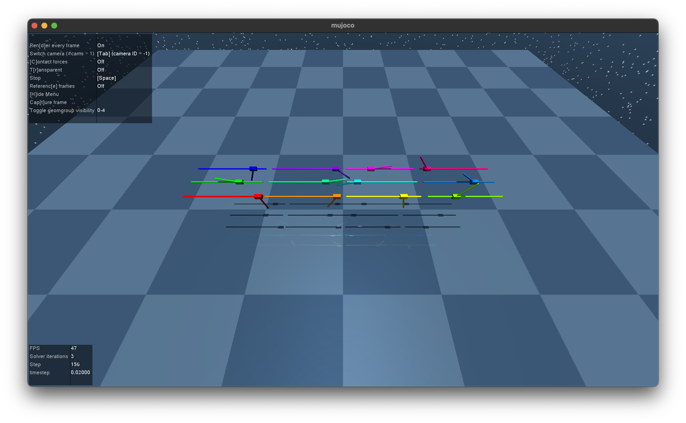
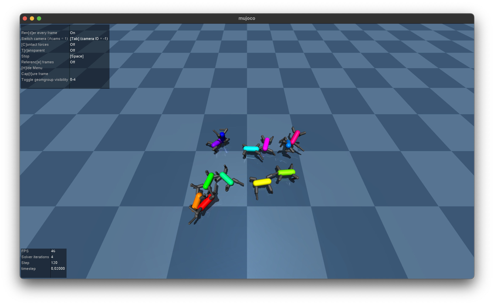

# UROB HW5 - Deep reinforcement learning through policy optimization

### About

This task should provide a minimalist introduction to policy gradient methods for deep reinforcement learning and illustrate the relative effectiveness of each method using simple, interpretable environments.

### Code

Use Python 3.10/11/12 for this assignment.

- **If you already have a conda environment set up (e.g. from the previous homework), you can use it. Just install the necessary libraries with `conda install --file requirements.txt`.**

- If you're on Ubuntu 20.04 or older, you can use deadsnakes (https://launchpad.net/~deadsnakes/+archive/ubuntu/ppa) to install a newer version of Python (3.10 or 3.11). Otherwise install it with `apt` (Ubuntu 22.04 and newer).

- On macOS, homebrew is recommended for installing Python 3.10/11/12.

- On Windows, install Python through the Microsoft Store, `winget` or with the official installer. The libraries we use unfortunately do not work well with WSL, it is only possible to run the code natively or use a Linux OS. **We do not guarantee it will run on Windows, experience shows that it is highly dependent on the exact hardware you have.**

You can set up a virtual environment for this assignment.

- macOS/Linux:
  The script `make_venv.sh` will create a virtual environment with the necessary dependencies for Unix systems. Run it with `bash make_venv.sh`. **Make sure python is available in your PATH with the version number, like `python3.10` or `python3.11`.**

- Windows:
  The script `make_venv.ps1` will create a virtual environment with the necessary dependencies for Windows. Run it with `.\make_venv.ps1` from within powershell. **Make sure python launcher is available in your PATH with the version number, like `py -3.10` or `py -3.11`.**

- When using the virtual environment, you have to activate it first.
  This is done by running `source rl-homework-venv/bin/activate` (or `source rl-homework-venv/bin/activate.fish` for fish shell) on Unix systems, or `.\rl-homework-venv\Scripts\Activate.ps1` on Windows.

If you don't want to use the virtual environment, you can install the necessary libraries globally by running `pip install -r requirements.txt`(make sure you use the correct pip version for your Python installation).

Once this is done, you can test whether the environment is set up correctly by running `python -m pytest -s`.

You should see something like this:

### Pendulum environment

First, in the notebook `task.ipynb` you will go through methods starting with Vanilla Policy Gradient/REINFORCE and ending with PPO, the current state-of-the-art.

Your task is to implement the loss functions used for training, which in some cases includes the computation of specific reward or value terms.

All of the implemented code should be in the file `solution.py`. You only need to submit this file to Brute (along with files for the optional part if you choose to do it) as a zip/tar archive.

This is the mandatory part of the assignment and is worth **10 points** in total.

- `policy_gradient_loss_simple` - Vanilla Policy Gradient/REINFORCE - **1 point**

- `discount_cum_sum` - general function for computing discounted cumulative sums - **2 points**

- `policy_gradient_loss_discounted` - Policy Gradient with discounted rewards - **1 point**

- `policy_gradient_loss_advantages` - Policy Gradient with advantages - **2 points**

- `value_loss` - Value loss for training a value function - **2 points**

- `ppo_loss` - Proximal Policy Optimization loss - **2 points**

### Walker environment

Using the methods you implemented in the first part and the already-provided functions for working with the (pendulum) environment, train a policy for the Walker environment.

**The objective is to travel as far as possible in the positive x-direction in a limited number of steps (1024 / cca 10 simulation seconds).**

This is evaluated in a tournament with up to 3 additional points awarded as follows:

- **1 point** for traversing least 1 meter in the Walker environment (less than 5 simulation seconds)

- **1 point** if your policy achieves falls within top 50-percentile of the submission distances.

- **1 point** if your policy falls within top 10-percentile of the submission distances.

Make sure you follow the exact specification described in `WalkerPolicy.py` and `walker_training.ipynb` to ensure your policy is evaluated correctly.

### Troubleshooting

If you run into some issues that you or an LLM of your choice can't resolve, please let me know at `korcadav@fel.cvut.cz`. I will ask my LLM :)
